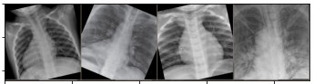

# CNN for the Classification of Chest X-ray Scans
---
Disclaimer: This work represents by no means a medical study and is merely an example of what can be done using CNNs in tasks that involve processing images. 



In this project, we define ***and train*** a CNN to classify chest x-ray scans taken from the [dataset](https://github.com/ieee8023/covid-chestxray-dataset) by Joseph Paul Cohen and Paul Morrison and Lan Dao.

Two solutions are provided using [ResNet34](https://arxiv.org/pdf/1512.03385.pdf). The first one, implementing the model directly from torchvision.models and the second one, implementing each layer of the model using torch API. We use [Cross Entropy Loss](https://towardsdatascience.com/understanding-binary-cross-entropy-log-loss-a-visual-explanation-a3ac6025181a) and [Stochastic Gradient Descent](https://towardsdatascience.com/a-visual-explanation-of-gradient-descent-methods-momentum-adagrad-rmsprop-adam-f898b102325c) to train the models. 

Data is separated between a validation and a training set. So that we can measure the model's performance on data it hasn't seen during training and avoid [overfitting](https://medium.com/predict/what-overfitting-is-and-how-to-fix-it-887da4bf2cba).

At the end, this allows us to get an accuracy close to 98% on the validation set.

A [Dockerfile](https://www.docker.com/) is provided. This allows to have a unified runtime environment. After instantiating the docker container, you will have a virtual environment with all the necessary dependencies. Since pytorch:1.5-cuda10.1-cudnn7 container is used, nvidia drivers >= 418 are required.

# Run on Linux (Not tested in other OS)
1. Install Docker following the instructions on the [link](https://docs.docker.com/engine/install/ubuntu/).
2. Install nvidia docker for gpu support from this [link](https://github.com/NVIDIA/nvidia-docker)
3. Open a terminal

4. Clone this repository and go to the repo folder
    ```bash
    cd covid19_xray_pytoch
    ```
5. Build the docker container (this may take several minutes)
    ```bash
    docker build . -t xray_classifier
    ```
6. Run the docker container. This will enable a terminal inside the container (user: developer - password: developer).
    ```bash
    docker run -p 8888:8888 -p 6006:6006 -v `pwd`/dev_ws:/usr/src/app/shared -it --rm --gpus all xray_classifier
    ```
7. Inside the container, run jupyter lab
    ```bash
    jupyter lab --ip=0.0.0.0 --port=8888 --allow-root
    ```
8. Go to the **train.ipynb** to go through the training process.
9. During training, open a terminal inside jupyter lab by clicking on the '+' button on the top left corner, and type the following to watch tensorboard's dashboard:
    ```bash
    tensorboard --logdir=./runs --bind_all
    ```
    This will open tensorboard server, after a couple minutes, go to the following link: localhost:6006 
    You will be able to see the training process as shown in the figure.